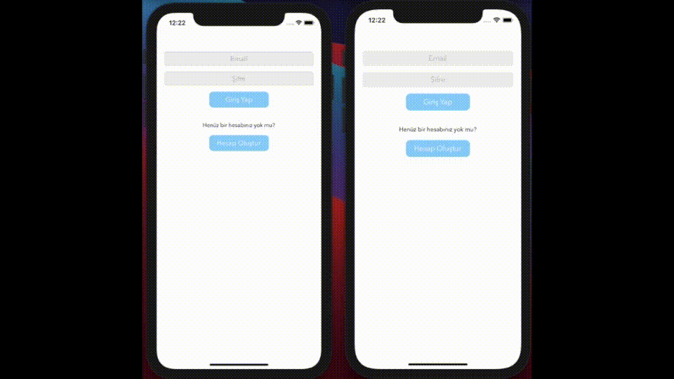

# Interaktif-Sozluk
MVC mimarisi kullanılarak geliştirilmiş, belli kategoriler altında gönderi oluşturabildiğiniz, gönderilerin beğenilip yorum yapılabildiği gerçek zamanlı bir sözlük uygulamasıdır. Uygulama içerisinde sıklıkla kullanılan sabit ifadeler, karmaşa olmaması açısından `Sabitler.swift` adlı dosyada tanımlanmıştır. Uygulamaya bir kez giriş yapıtğınızda, `Çıkış` butonuna tıklamadığınız sürece giriş yapmanıza gerek kalmayacaktır. Kullanıcılar sadece kendi gönderilerini silebilmekte ve düzenleyebilmektedir. Popüler kategorisinde o gün paylaşılmış gönderiler beğeni sayısına göre sıralanmış şekilde kullanıcıya sunulmaktadır.

Uygulamada şu ana unsurlar kullanılmıştır :  
- [Firebase](https://firebase.google.com) Framework
- MVC Mimarisi
- Extensions
- Navigation controller
- Table view controller

# Intro

